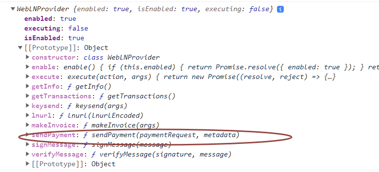

# 📑 Extending SendPayment Method

WebLN `SendPayment` which takes `paymentRequest` parameter holding the[ Bolt11 Invoice](https://github.com/lightning/bolts/blob/master/11-payment-encoding.md), we can extend this function to add an extra “optional” parameter named `metadata` which will store metadata as a string and is passed further to the Wallets.

_**Function Signature:**_

```
sendPayment(paymentRequest: string, metadata?: string): Promise<SendPaymentResponse>;
```

**WebLN Provider attached by wallets before**

.png>)

**WebLN Provider attached by wallets after implementation of this spec**



### Passing Metadata Via SendPayment Method

Now the extended version of the `SendPayment` method implemented by the wallet is sent to the WebLN-enabled client. Now clients can pass metadata along with Invoice using such function.

\
_Example:_

```
webln.sendPayment(invoice, metadata)
  .then(function (r) {
    // Required constraint to protect metadata as a rule while paying empty invoices
    if (r != undefined) {
      // Provide metadata after successful payment
      // Eg. Allow users to download a song after payment is successful
    }
  })
```
